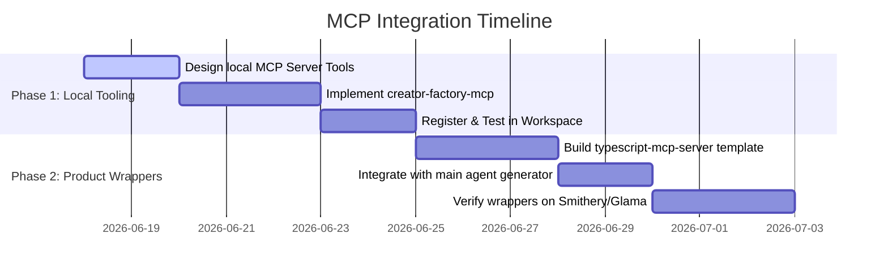

# MCP Integration Plan: Extending the Creator Factory with Model Context Protocol

This document outlines the research, design, and implementation path for adding **Model Context Protocol (MCP)** capabilities to the **Apify Creator Factory**. 

It details two distinct opportunities:
1. **MCP Connectors as Monetizable B2B Products**: Packaging our "Pilot Family" of web-scraping/AI Actors as standardized, discoverable MCP servers, enabling third-party AI agents (Cursor, Claude Desktop, Copilot, etc.) to use them as native tools.
2. **Local MCP Tooling for Project Development**: Running a local Creator Factory MCP server that exposes the factory’s pipeline (Actor generation, testing, schema audit, store sync) as structured tools for our local development agents.

---

## 1. Context & Architecture Overview

The **Model Context Protocol (MCP)** is an open standard designed by Anthropic that establishes a secure, structured channel for AI models to interact with local or remote databases, file systems, and API tools. By implementing MCP in our factory, we transition our Actors from isolated web scrapers into **AI-native capability modules**.

```mermaid
graph TD
    subgraph Client Environments (Claude, Cursor, IDEs)
        A[AI Agent / LLM Client]
    end

    subgraph MCP Connector Layer (Monetizable Products)
        B[Pilot MCP ServerWrapper]
        C[Glama / Smithery Registries]
    end

    subgraph Apify Platform Layer
        D[Apify API / Client]
        E[Pilot Family Actors]
    end

    subgraph Workspace Development Layer (Private Tooling)
        F[Creator Factory MCP Server]
        G[Workspace Agent / Developer]
    end

    %% Client Interactions
    A -- JSON-RPC over Stdio/SSE --> B
    A -- JSON-RPC over Stdio --> F

    %% Wrapper Interactions
    B -- apify-client HTTP requests --> D
    D --> E

    %% Local Dev Interactions
    F -- Calls local CLI/Scripts --> G
    F -- Local SQLite/JSON Registry --> H[(actor-registry.json)]
```

---

## 2. Product Strategy: MCP Connectors as Monetizable Products

Right now, our B2B Actors (e.g., `SitePilot`, `LeadPilot`, `AdPilot`) run on the Apify platform and are used by agencies, sales reps, and operators. However, **AI agents themselves** are rapidly becoming the primary consumers of data. An LLM agent cannot easily execute a raw Apify run without complex coding, but it *can* call an MCP tool natively.

### 2.1 The MCP Server Wrapper Architecture
Instead of rewriting our Actors, we can generate a lightweight **TypeScript MCP Server Wrapper** for each Actor (or group of Actors). This server exposes a set of tools that invoke the corresponding Actor on the Apify platform.

```
[Cursor/Claude Chat] ➔ Call tool "scrape_leads" ➔ [Pilot MCP Server]
                                                           │ (uses apify-client)
                                                           ▼
[Dataset returned as JSON text] ◀─── [Get Dataset] ◀─── [Apify Runs Actor]
```

*   **The Client Tool Schema**: The MCP server exposes tools matching the Actor's input schema. For example, `lead-pilot-mcp` would expose:
    ```typescript
    tool("scrape_leads", {
      queries: array(string(), "Search terms or locations"),
      limit: number("Max leads to extract"),
      depth: number("Scrape depth limit")
    })
    ```
*   **Execution Flow**:
    1. The AI client calls the tool `scrape_leads` with parameters.
    2. The MCP server initializes `apify-client` using the user's `APIFY_TOKEN`.
    3. The server calls `client.actor(actorId).call(inputs)`.
    4. The server polls the run until it completes, fetches the default dataset items, and returns them as a structured string back to the AI client.
*   **Pricing & Monetization**:
    *   **User-provided Token**: The user configures the server with their own Apify API Token. The usage costs are billed directly to their Apify account (using our Pay-Per-Event PPE pricing).
    *   **Hosted SaaS Connector**: We host the MCP server as an SSE (Server-Sent Events) web service. We charge a monthly subscription or per-query fee, routing requests to our backend pool of actors.

### 2.2 Standard MCP Connector Template
We will create a new generator template inside `/creator-factory/templates/typescript-mcp-server`.
A generated MCP server contains:
*   `src/index.ts`: The entry point that sets up the `@modelcontextprotocol/sdk` server over standard I/O (Stdio).
*   `src/tools.ts`: Definitions of available tools mapped from the Actor's `.actor/input_schema.json`.
*   `package.json`: Dependencies, including `@modelcontextprotocol/sdk` and `apify-client`.
*   `README.md`: Instructions on how to add this connector to Cursor, Claude Desktop, or VS Code.

---

## 3. Developer Strategy: MCP for Local Project Development

To speed up our own development lifecycle, we can expose the Creator Factory's core features as an MCP Server. This allows our workspace agent (and the developer in Cursor/Claude) to interact with the project semantically rather than running raw bash scripts.

### 3.1 Comparison of Development Workflows

| Action | Traditional CLI Workflow | Proposed Local MCP Workflow |
| :--- | :--- | :--- |
| **List Actors** | `cat reports/actor-registry.json` | Call `list_actors()` tool ➔ Returns clean JSON |
| **Run Selection** | `npm run main-agent` (runs fully in background) | Call `select_actor_ideas(prompt)` ➔ Interactive choices |
| **Test Actor** | `cd generated-actors/lead-pilot && apify run` | Call `run_pact_test(slug)` ➔ Returns success/fail state |
| **Validate Schema** | `npx apify validate-schema` | Call `validate_actor_schema(slug)` ➔ Returns lint error IDs |
| **Store Sync** | `npm run sync-store` | Call `sync_store_listing()` ➔ Returns status of API updates |
| **Icon Generation** | Manually run generator & `sips` | Call `generate_actor_icon(slug, monogram)` ➔ Automatically writes |

### 3.2 Tool Schema for the Local `creator-factory-mcp-server`

Here are the specific tools the developer MCP server will expose:

1.  **`list_factory_actors`**:
    *   *Input*: None.
    *   *Output*: Returns details on all generated actors, their current development status (`generated`, `testing`, `pushed`, `published`), pricing settings, and local paths.
2.  **`run_pact_test`**:
    *   *Input*: `actorSlug` (string).
    *   *Output*: Runs the local PACT testing loop for the specified actor and returns structured pass/fail results.
3.  **`validate_actor_schema`**:
    *   *Input*: `actorSlug` (string).
    *   *Output*: Validates `.actor/input_schema.json` and `.actor/output_schema.json` against Apify guidelines.
4.  **`sync_store`**:
    *   *Input*: `actorSlug` (optional string, syncs all if omitted).
    *   *Output*: Triggers store metadata and pricing updates via the Apify API.
5.  **`generate_actor_icon`**:
    *   *Input*: `actorSlug` (string), `prompt` (string), `monogram` (string).
    *   *Output*: Invokes imagegen, runs macOS `sips` formatting, and saves the final PNG to `.actor/icon.png`.
6.  **`generate_new_actor`**:
    *   *Input*: `name` (string), `description` (string), `template` (enum).
    *   *Output*: Scaffolds a new actor inside `/generated-actors` using the chosen template.

### 3.3 Configuration for Local IDEs
Once the server is built, it can be registered locally. 

**For Claude Desktop (`~/Library/Application Support/Claude/claude_desktop_config.json`):**
```json
{
  "mcpServers": {
    "apify-creator-factory": {
      "command": "node",
      "args": ["/Users/danny/Desktop/apify/creator-factory/apps/api/dist/mcp-server.js"],
      "env": {
        "APIFY_TOKEN": "YOUR_APIFY_TOKEN",
        "OPENAI_API_KEY": "YOUR_OPENAI_API_KEY"
      }
    }
  }
}
```

---

## 4. Implementation Roadmap



### Phase 1: Creating the Local Developer MCP Server
1. Add `@modelcontextprotocol/sdk` and `@types/node` to `creator-factory/package.json` devDependencies.
2. Build a new server entry point: `creator-factory/src/mcp/local-mcp-server.ts`.
3. Map our shared database operations (`db.listActors()`), `runPact()`, `runQualityGate()`, `deployActor()`, and store sync script to MCP tools.
4. Add a build script compilation target for the MCP server.
5. Create a verification script to validate local stdio communication.

### Phase 2: Building the MCP Connector Product Template
1. Create `/creator-factory/templates/typescript-mcp-server` scaffold.
2. Update the main agent (`creator-factory/src/main-agent/mainFlow.ts`) to optionally generate a matching `.mcp-wrapper/` folder next to the generated actor.
3. Configure the wrapper to read inputs from the user, pass them to the Apify actor, and yield datasets as JSON.
4. Add instructions to generated READMEs on how users can install the actor as a local tool in Claude Desktop and Cursor.

---

## 5. Summary of Benefits

1.  **New Revenue Channels**: Reaches developers and AI power-users who want instant tools in their chats without using the Apify website.
2.  **Increased API Stickiness**: Encourages users to buy Apify platform credits to power their custom LLM workflows.
3.  **Bulletproof Development**: Removes manual command errors. IDE agents (like Cursor/Cline) can perform factory workflows natively with zero configuration mistakes.
4.  **Cohesive Brand Positioning**: The "Pilot Family" (SitePilot, AdPilot, LeadPilot) can be deployed as unified tool bundles (e.g. `npm install -g @pilot-family/mcp-connectors`).
