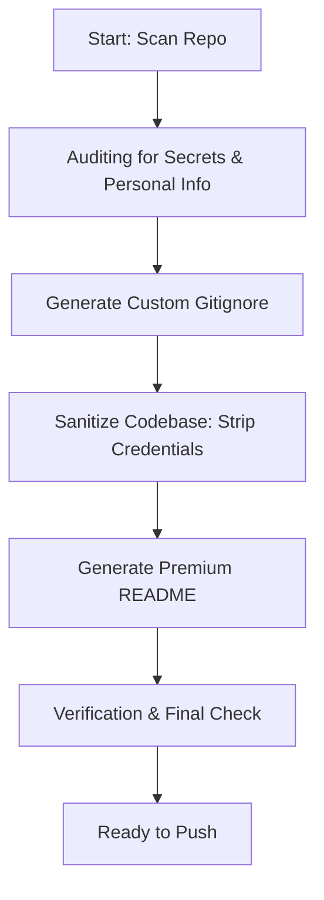

# Open Source Push (OSS-Push) Agent Framework

This framework provides standard guidelines, agent swarm definitions, and utility skills to audit, sanitize, document, and prepare any software repository for public open-source publication on GitHub.

## 1. Directory Structure

This module resides in the root directory under `open-source-push/`:
```
open-source-push/
├── AGENTS.md                 # Core instructions and audit rules (this file)
├── agents/
│   └── repo-sanitizer-agent/
│       └── SKILL.md          # Agent to scan and strip credentials/sensitive data
└── skills/
    ├── oss-readme-generator/
    │   └── SKILL.md          # Standard guidelines for writing premium READMEs
    ├── oss-changelog-generator/
    │   └── SKILL.md          # Semantic changelog builder (SemVer & Keep a Changelog)
    └── gitignore-generator/
        └── SKILL.md          # Config and templates to build project-agnostic gitignores
```

## 2. Core Preparation Workflow

When preparing a project for open-source publication, the prep agent swarm executes these steps:



### Step 1: Auditing & Detection
1. Scan all files in the directory recursively.
2. Search for common secret patterns:
   - Auth tokens (Bearer, Basic, API keys, client secrets).
   - Personal information (email addresses, phone numbers, localized file system paths like `/Users/username/Desktop/...`).
   - Local database credentials, database URLs, and connection strings.
   - Private key files (`.pem`, `.key`, `.p12`).

### Step 2: Gitignore Enforcement
Ensure common build folders, OS-specific files, package locks (if not wanted), node_modules, and cache/temporary folders are excluded.

### Step 3: Premium README Scaffolding
Create a buyer-facing, outcome-oriented README showing:
1. **Core Features & Problem Solved**: Clear business value and target audiences.
2. **How It Works**: High-level workflow sequence.
3. **Usage & Configuration**: Setup of environment files and command execution.
4. **Input/Output Specs**: Clear schemas showing what goes in and what comes out.

---

## 3. General Safety Guardrails
- **Zero Secrets Policy**: Never commit `.env` or configuration files with active credentials.
- **Redaction over Deletion**: If a path or token is needed as an example, replace it with `YOUR_TOKEN` or a generic placeholder (e.g. `/home/user/...` instead of `/Users/danny/...`).
- **Clean Registry**: Clear local runtime logs, cache folders, and databases before zipping or tracking.
